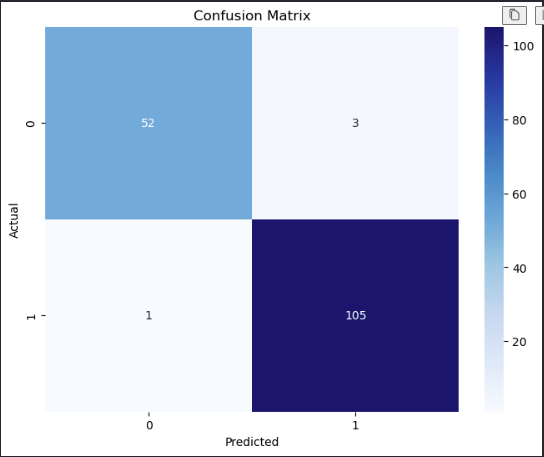
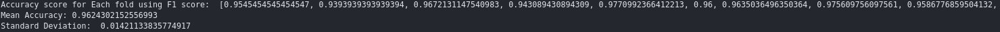

# CREDIT RISK MODELLING FINAL PROJECT

## Overview

In the dynamic landscape of financial services, one of the critical challenges faced by lending institutions is assessing the creditworthiness of potential borrowers. Making accurate predictions about whether an individual or entity is likely to default on a loan is crucial for minimizing financial risks and ensuring the stability of the lending portfolio. This project aims to develop a machine learning model for credit risk classification, providing a systematic and data-driven approach to evaluate the credit risk associated with loan applicants.

## Problem definition

The main goal is to build a predictive model that can classify loan applicants into two categories: "low risk" and "high risk.
" A "low risk" rating indicates that the borrower is likely to repay the loan, while a "high risk" rating indicates a high  risk of default.
The model results help credit institutions make informed decisions about approving or rejecting loan applications, thereby optimizing the allocation of financial resources.

## Significance of credit risk modelling in financial institutions

Credit risk modeling is of great importance to financial institutions for several reasons, as it plays an important role in managing and mitigating the risks associated with credit activities.
Here are some key aspects that highlight the importance of credit risk modeling in financial institutions.

### 1. Risk Mitigation:
###### Identification of High-Risk Borrowers: 
Credit risk modeling helps identify individuals and individuals.
Businesses are more likely to default on loans.
Accurately assessing a borrower's creditworthiness allows financial institutions to avoid lending to high-risk individuals and reduce the risk of their overall  loan portfolio.
### 2.Optimization of resource allocation
###### Efficient use of capital
Financial institutions have limited resources, and efficient capital allocation  is essential.
Credit risk modeling allows you to focus  resources on borrowers with  lower credit risk profiles, thereby reducing the potential impact of default on an institution's financial health.
### 3.Improved decision making
###### Data-driven decision making
Credit risk models provide a systematic and data-driven approach to decision making.
Lenders can make more informed and objective decisions about loan approvals, interest rates, and credit limits based on an applicant's projected credit risk.
### 4.Regulatory Compliance
###### Regulatory Compliance
Many financial institutions are subject to regulatory requirements that require the use of sophisticated risk management practices.
Credit risk modeling helps financial institutions comply with regulatory standards by implementing robust risk assessment methodologies.
### 5.Portfolio Management Enhancements
###### Diversification Strategies
Credit risk modeling helps design diversified credit portfolios.
Understanding the risk profile of individual loans allows financial institutions to create portfolios that balance risk and return and improve overall portfolio performance.
### 6.NPL Reduction
###### Default Minimization
The main objective of credit risk modeling is to minimize the occurrence of loan defaults.
This directly contributes to reducing the number of non-performing loans and improving the overall quality of the loan portfolio.
### 7.Improve profitability
###### Balance between risk and return
Credit risk models help find the optimal balance between risk and return.
Financial institutions can offer competitive interest rates to low-risk borrowers while adjusting interest rates to high-risk borrowers to maximize profitability without compromising financial stability.
### 8.Customer Relationship Management
###### Maintaining Good Customer Relationships
Accurate credit risk assessment ensures that borrowers receive loans commensurate with their financial capabilities.
This reduces the likelihood of borrowers falling into financial difficulties due to excessive creditworthiness and builds good relationships with customers.
### 9.Adaptability to economic conditions
###### Coping with economic downturns
Credit risk models are designed to adapt to changing economic conditions.
During economic downturns, models can help financial institutions predict the likelihood of increased defaults and adjust  lending strategies accordingly.

## Data Characteristics
The dataset comprises of a diverse set of features including account age, creditors age, how long the account has been active etc.
The data has 14933 records of which numerical data is 133 columns and categorical data is 6 columns
## Model Development
During model development, after successfully cleaning, exploring and transforming the data, we used
* 1. Random forest classifier
* 2. Extra tree classifier

The model was trained with balanced and unbalanced data and below were the results
I used K fold to train the models
## Model evaluation
From both classification algorithms, we can conlude to use extra tree classifier as it gave a better result
## Result interpretation
#### 1. Confusion Matrix result

#### 2. Accuracy score

Accuracy score is 97%
#### 3. Precision score

Precision score is 97%
#### 4. Recall score

Recall score is 95%
#### 5. Fi score

F1 score is 96%

## Challenges
#### 1.Imbalanced dataset
SMOTE-ENN combines two techniques: SMOTE, which oversamples minority classes, and Edit Nearest Neighbor (ENN), which cleans up the dataset by removing  noisy samples.
This approach aims to reduce class imbalance by generating synthetic samples of  minority classes and adjusting the dataset by removing certain instances.

## Conclusion
In summary, credit risk modeling projects contribute to improving the decision-making process of  financial institutions.
Using machine learning technology, it becomes a powerful tool to assess creditworthiness, minimize default risk, and ultimately foster a more resilient and profitable credit environment.