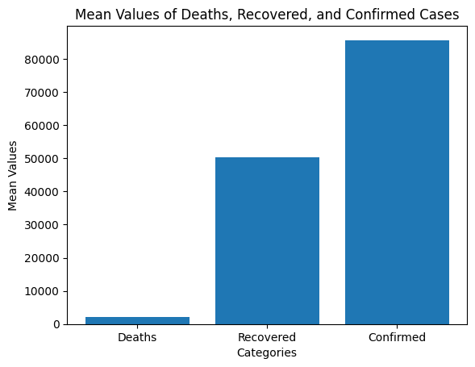
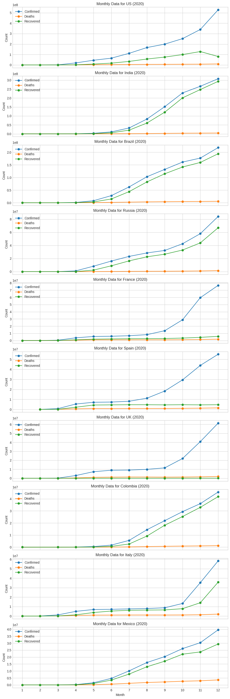
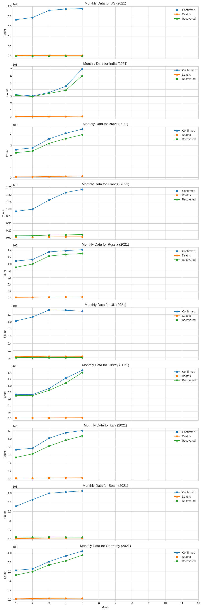
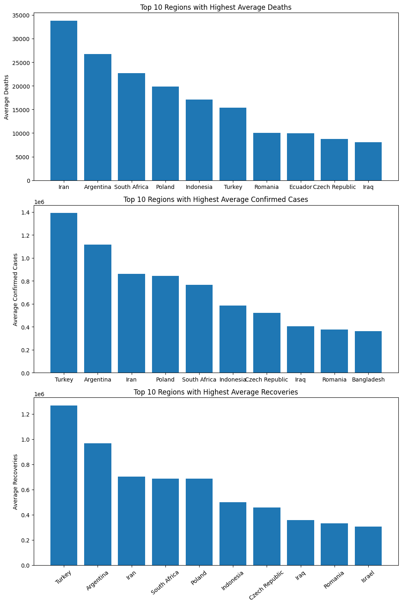
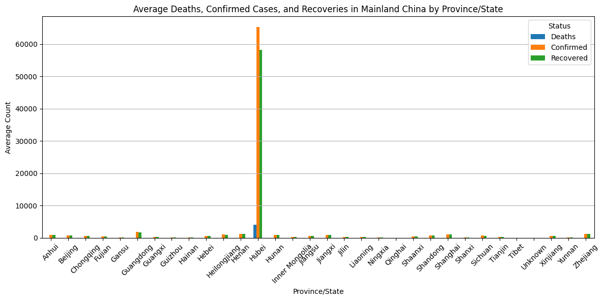

# Covid 19 Data analysis capstone project

## Introduction

From the World Health Organization – On  December 31, 2019, the WHO warned of several cases of pneumonia in Wuhan city, Hubei province, China.
This virus did not match any other known viruses.
This caused concern because with a new virus, we don't know how it will affect people.
Therefore, when daily  information about data subjects is made available to the broader data science community, interesting insights can be obtained.
Johns Hopkins University has created an excellent dashboard using data from affected cases.
Data will be extracted from the relevant Google Sheets and made available here.

### Data description

###### Column Description

Main file in this dataset is covid_19_data.csv and the detailed descriptions are below.

covid_19_data.csv

Sno - Serial number
ObservationDate - Date of the observation in MM/DD/YYYY
Province/State - Province or state of the observation (Could be empty when missing)
Country/Region - Country of observation
Last Update - Time in UTC at which the row is updated for the given province or country. (Not standardised and so please clean before using it)
Confirmed - Cumulative number of confirmed cases till that date
Deaths - Cumulative number of of deaths till that date
Recovered - Cumulative number of recovered cases till that date
2019_ncov_data.csv

## Data Analysis

from the data, we had to do an in depth data analysis of it and here is the results.

Based on the above observation, it becomes evident that the overall mean of confirmed cases was relatively high. However, there's a silver lining to this data: the average number of deaths was lower than the number of recovered cases. This encouraging finding suggests that the pandemic was effectively managed and brought under control.

Based on the above observations, it is clear that the overall average of confirmed cases was relatively high.
However, there is a silver lining to this data.
The average number of deaths was 4,444, which was lower than the number of recoveries.
This encouraging result suggests that the pandemic has been effectively managed and brought under control.

There have been no notable events in 2021, and according to our research, the United States continues to lead in the  number of infections.
However, the recovery rate remains low compared to other countries such as India, which has the second-highest number of infections.

Let's summarize the survey results.
Find out the average number of deaths, recoveries, and infections for the top 10 countries.
From our findings, we can conclude that Iran recorded the highest number of deaths on average.
This may be due to medical deficiencies.
Meanwhile, Turkey had the highest number of confirmed cases compared to Iran, but recorded the highest number of recoveries overall.
It can be concluded that Turkey contributed the most to containing the disease, and the results were very impressive.

Let's dig a little deeper into the data and discover some interesting insights.
Among all  provinces in mainland China, Hubei had the highest number of confirmed infections, deaths, and recoveries.
This could suggest that the virus may have originated from there or had a major impact on Hubei, but it may also indicate that Hubei has not been able to cope with the challenges posed by COVID-19.
It also means being at the forefront of the Given the gravity of the situation in Hubei, we could have seen this as an opportunity to focus  on providing the necessary support and resources to help those affected.

